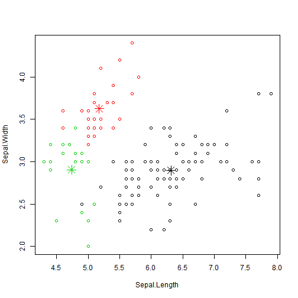
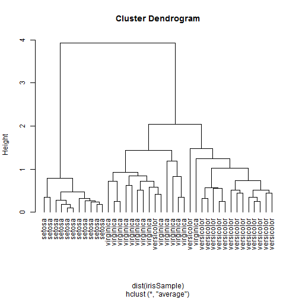
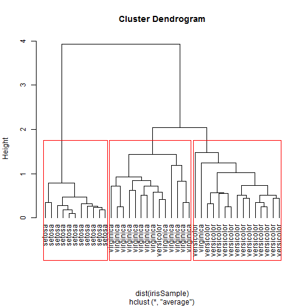

Clustering
========================================================
## The k-Means Clustering


```r
iris2 <- iris
iris2$Species <- NULL
(kmeans.result <- kmeans(iris2, 3))
```

```
## K-means clustering with 3 clusters of sizes 96, 33, 21
## 
## Cluster means:
##   Sepal.Length Sepal.Width Petal.Length Petal.Width
## 1        6.315       2.896        4.974      1.7031
## 2        5.176       3.624        1.473      0.2727
## 3        4.738       2.905        1.790      0.3524
## 
## Clustering vector:
##   [1] 2 3 3 3 2 2 2 2 3 3 2 2 3 3 2 2 2 2 2 2 2 2 2 2 3 3 2 2 2 3 3 2 2 2 3
##  [36] 2 2 2 3 2 2 3 3 2 2 3 2 3 2 2 1 1 1 1 1 1 1 3 1 1 3 1 1 1 1 1 1 1 1 1
##  [71] 1 1 1 1 1 1 1 1 1 1 1 1 1 1 1 1 1 1 1 1 1 1 1 3 1 1 1 1 3 1 1 1 1 1 1
## [106] 1 1 1 1 1 1 1 1 1 1 1 1 1 1 1 1 1 1 1 1 1 1 1 1 1 1 1 1 1 1 1 1 1 1 1
## [141] 1 1 1 1 1 1 1 1 1 1
## 
## Within cluster sum of squares by cluster:
## [1] 118.652   6.432  17.670
##  (between_SS / total_SS =  79.0 %)
## 
## Available components:
## 
## [1] "cluster"      "centers"      "totss"        "withinss"    
## [5] "tot.withinss" "betweenss"    "size"         "iter"        
## [9] "ifault"
```

```r
table(iris$Species, kmeans.result$cluster)
```

```
##             
##               1  2  3
##   setosa      0 33 17
##   versicolor 46  0  4
##   virginica  50  0  0
```

```r
plot(iris2[c("Sepal.Length", "Sepal.Width")], col = kmeans.result$cluster)
points(kmeans.result$centers[,c("Sepal.Length", "Sepal.Width")], col = 1:3,
       pch = 8, cex=2)
```

 

## Hierarchical Clustering

```r
idx <- sample(1:dim(iris)[1], 40)
irisSample <- iris[idx,]
irisSample$Species <- NULL
hc <- hclust(dist(irisSample), method="ave")
plot(hc, hang = -1, labels=iris$Species[idx])
```

 

```r
plot(hc, hang = -1, labels=iris$Species[idx])
# cut tree into 3 clusters
rect.hclust(hc, k=3)
```

 

```r
groups <- cutree(hc, k=3)
```
